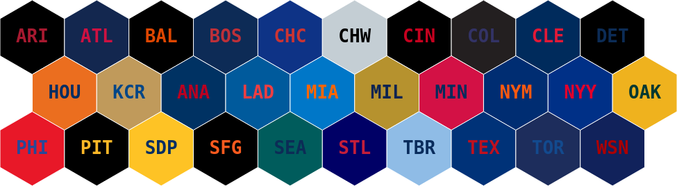

# mlbcolors

Easy access to the official colors of every team in Major League Baseball. Based on [jimniels/teamcolors](https://github.com/jimniels/teamcolors).


### Python Installation

```bash
$ pip install mlbcolors
```

### Python Usage

```bash
>>> import mlbcolors
>>> mlbcolors.get("CHC")
['#CC3433', '#0E3386']
```

### JavaScript usage

A JSON file keyed by team abbreviation is available at [unpkg.com/mlbcolors/mlbcolors/data.json](https://unpkg.com/mlbcolors/mlbcolors/data.json). See it in use on ObservableHQ at [@palewire/the-official-color-of-every-team-in-major-league-baseball](https://observablehq.com/@palewire/the-official-color-of-every-team-in-major-league-baseball)
